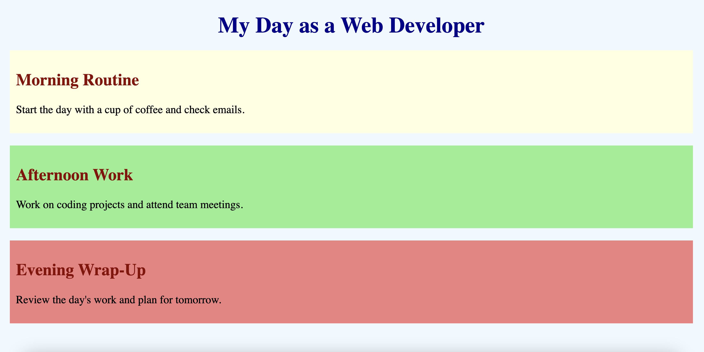
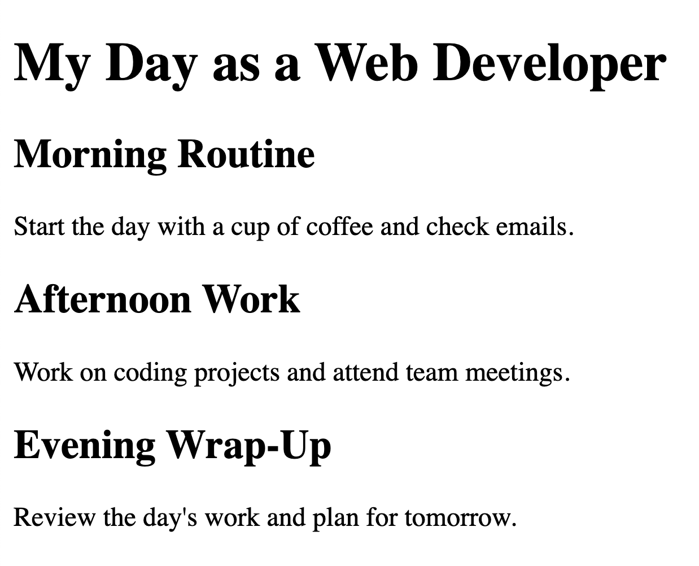

# CSS Style and Linking Basics



## Description
In this assignment, you will create a basic webpage that outlines a typical day as a web developer. The project will demonstrate how to structure an HTML document and apply basic CSS styling. You will start by creating the HTML file, link a CSS file to style the page, and then break down the CSS into individual components to understand their functions.

## Project Structure

```
/BasicCSS
  index.html
  styles.css
```

# Instructions ✅

## 1. **Create the Project Folder and Files**
  - [ ] Create a folder named `BasicCSS` to store all your project files.
  - [ ] Inside the `BasicCSS` folder, create a file named `index.html`. This will be your main HTML file.
  - [ ] Also, in the `BasicCSS` folder, create another file named `styles.css`. This file will contain the CSS used to style your HTML content.

## 2. **Start with an HTML Boilerplate**
Now that you have your files set up, start by adding the basic HTML5 boilerplate.

  - [ ] Open your currently empty index.html file and add the following code to it.

```html
<!DOCTYPE html>
<html lang="en">
<head>
  <meta charset="UTF-8">
  <meta name="viewport" content="width=device-width, initial-scale=1.0">
  <title>My Day as a Web Developer</title>
  <!-- CSS link will go here  -->
</head>
<body>
  <!-- web page code goes here -->
</body>
</html>
```

**Explanation:**
Declares the document as HTML5 and sets up the essential metadata and styles.

## 3. **Linking the CSS File**
After setting up the HTML boilerplate, the next step is to link your CSS file which is used to apply styling to the HTML elements.

  - [ ] Add the following code **under the `<title>` tag but inside the `<head>` of your HTML document:

   ```html
   <link rel="stylesheet" href="styles.css">
   ```

**Explanation:**
The CSS link is an HTML tag that connects an external CSS file to an HTML document. 
 

## 4. **Add Content to the Body**
Next, you'll add the content that will be displayed on the webpage inside the `<body>` tags.

- [ ] Add the following code inside the `<body></body>` tags of your HTML document:

   ```html
   
     <h1 id="title">My Day as a Web Developer</h1>

     <div class="morning">
       <h2>Morning Routine</h2>
       <p>Start the day with a cup of coffee and check emails.</p>
     </div>

     <div class="afternoon">
       <h2>Afternoon Work</h2>
       <p>Work on coding projects and attend team meetings.</p>
     </div>

     <div class="evening">
       <h2>Evening Wrap-Up</h2>
       <p>Review the day's work and plan for tomorrow.</p>
     </div>
 
   ```

**Explanation:**
The code inside the <body> tags defines the main content of a web page that users interact with and see on their screens.


## 5. **Test the HTML Structure**
Take a look at your progress so far.

- [ ] Before adding any CSS, open your `index.html` file in a browser to see how it looks. It should display plain text without any styling as seen below...

##


##

Now add some "style" to your web page !

## 6. **Styling the Body Section**
The first step is to apply a background color and margin to the entire page:

- [ ] Open the `styles.css` file and add the following code

```css
/* Style the body */
body {
    background-color: #f0f8ff; /* Light blue background */
    margin: 20px; /* Add margin around the page */
}
```

**Explanation:**
The background-color property gives the page a light blue background, while the margin property adds space around the entire page.

## 7. **Styling the Title**
Next, you'll style the main title to make it stand out:

- [ ] Add the following code next in your `styles.css` file

```css
/* Change the text color of the title */
#title {
    color: darkblue;
    font-size: 36px;
    margin-bottom: 20px;
    text-align: center;
}
```

**Explanation:**
Style the main title by changing its text color to dark blue, increasing the font size, adding space below it, and centering it on the page.

## 8. **Styling the Morning Section**
Each section of your webpage will have its own unique style. Start with the morning section:


- [ ] Add the following code next in your `styles.css` file

```css
/* Style the morning section */
.morning {
    background-color: lightyellow;
    font-size: 18px;
    padding: 10px;
    margin-bottom: 20px;
}
```

**Explanation:**
This code sets the morning section's color, font size, and defines the padding and margins for this section.

## 9. **Styling the Afternoon Section**
Now, style the afternoon section:

- [ ] Add the following code next in your `styles.css` file

```css
/* Style the afternoon section */
.afternoon {
    background-color: lightgreen;
    font-size: 18px;
    padding: 10px;
    margin-bottom: 20px;
}
```

**Explanation:**
This code sets the afternoon section's color, font size, and defines the padding and margins for this section.

## 10. **Styling the Evening Section**
Finally, style the evening section:

- [ ] Add the following code next in your `styles.css` file

```css
/* Style the evening section */
.evening {
    background-color: lightcoral;
    font-size: 18px;
    padding: 10px;
}
```

**Explanation:**
This code sets the evening section's color, font size, and defines the padding and margins for this section.

## 11. **Styling All Headers**
The last step is to style all the `h2` headers in all the sections:

- [ ] Add the following code next in your `styles.css` file

```css
/* Change the text color for all h2 elements */
h2 {
    color: darkred;
}
```
**Explanation:**
The `color` property changes the text color of all `h2` elements to dark red.

##

## Testing Your Project

After completing the HTML and CSS files, save them and refresh your browser to see the styled webpage. You should notice the background colors, text alignments, and other styles applied.

### Suggested things to test:
- Ensure that the `h1` title is centered and in dark blue.
- Check that each section (`morning`, `afternoon`, `evening`) has the correct background color.
- Verify that the `h2` headers are dark red.

## Conclusion

By completing this project, you’ve learned how to:
- Structure a basic HTML document.
- Link an external CSS file to style your webpage.
- Apply fundamental CSS properties to enhance the appearance of a webpage.

##

### Solution codebase 👀
🛑 **Only use this as a reference** 🛑

💾 **Not something to copy and paste** 💾

**Note:**  This lab references a solution file located [here](https://github.com/HackerUSA-CE/aisd-wde-03-adding-a-stylesheet/tree/solution) (link not shown).

---

© All rights reserved to ThriveDX
